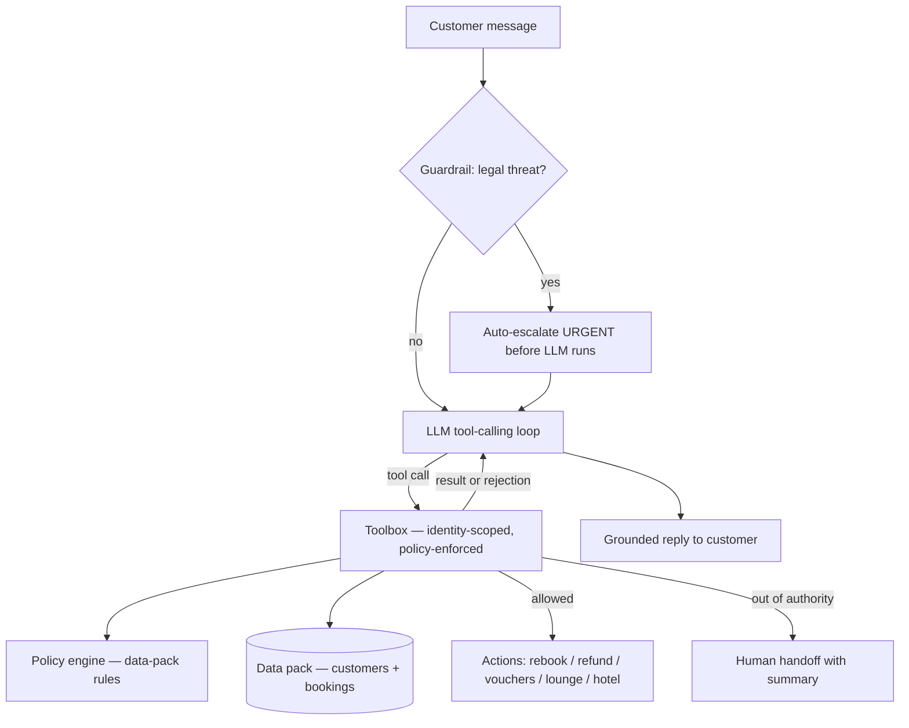

# Customer-Facing Resolution Agent — Airline Disruption

An LLM-powered agent that resolves flight-disruption conversations. It verifies the customer's identity, reads their booking, checks what they're entitled to under airline policy, executes allowed actions, and escalates anything outside its authority — all backed by a fixed data pack.

**Key design principle:** The LLM handles language and intent; deterministic code handles policy and authority. The model cannot invent compensation or waive fees — the tools it calls simply refuse.

---

## What it does

- Identifies the customer via booking reference (PNR) + registered email
- Fetches their booking and live flight status from the data pack
- Determines entitlements (refund, rebooking, meal voucher, lounge access, hotel) based on airline policy rules
- Executes allowed actions (refund, rebook, issue compensation)
- Escalates anything beyond its authority (upgrades, fare waivers >₹1,500, full-night hotels, etc.) to a human agent with a full handoff summary
- Keeps a complete conversation + action record, exportable as JSON

---

## Architecture



**Key files:**
```
app.py                  Streamlit web UI (chat + action record + escalations + export)
agent/policy.py         Deterministic entitlement rules
agent/tools.py          Guarded tools + OpenAI tool schemas
agent/agent.py          Guardrail → LLM tool loop → reply
agent/prompts.py        System prompt (tone, authority limits, decision rules)
agent/llm.py            Provider-agnostic LLM client with retry + model fallback
data/data_pack.json     Customer profiles + bookings
```

---

## How to run

### 1. Install dependencies

```bash
pip install -r requirements.txt
```

### 2. Set up your API key

Copy the example env file and add your Groq API key:

```bash
cp .env.example .env
```

Open `.env` and fill in:

```
GROQ_API_KEY=your_key_here
LLM_PROVIDER=groq
LLM_MODEL=openai/gpt-oss-20b
```

Get a free Groq key at [console.groq.com/keys](https://console.groq.com/keys) (no credit card required).

### 3. Start the app

```bash
streamlit run app.py
```

Open [http://localhost:8501](http://localhost:8501) in your browser.

### 4. (Optional) Run scripted scenario tests

```bash
python -m scripts.run_scenarios
```

---

## Known limitations

- Data is in-memory/JSON — refunds, vouchers, and hotels are simulated records, not real integrations.
- LLM wording varies between runs; the policy layer prevents unsafe actions regardless of wording.
- Legal-threat detection uses regex + prompt heuristics and favours over-escalating over missing a threat.
